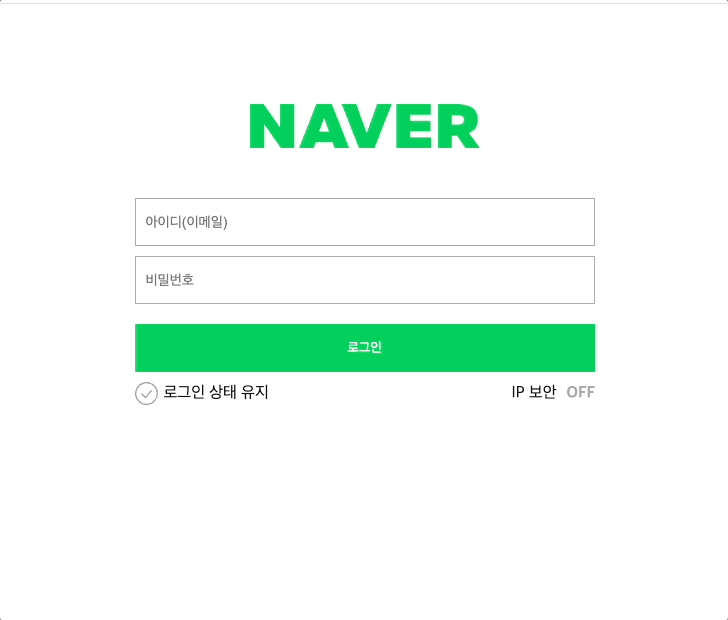
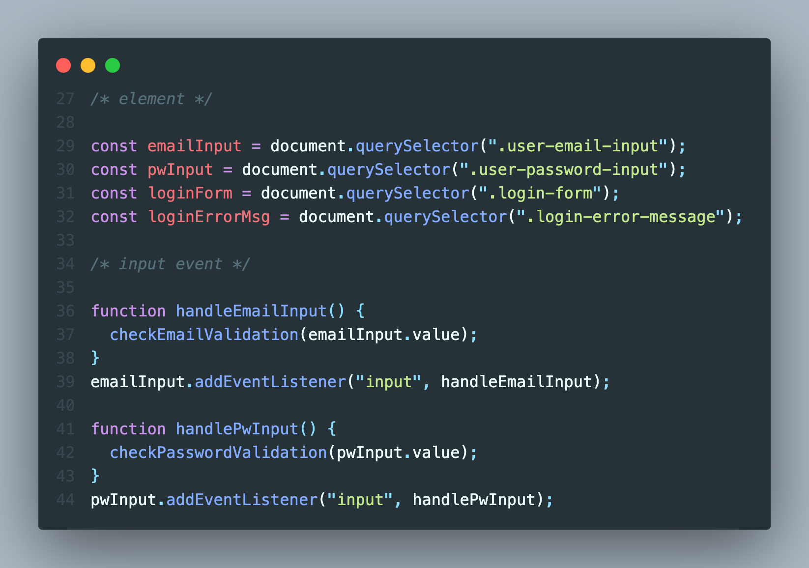
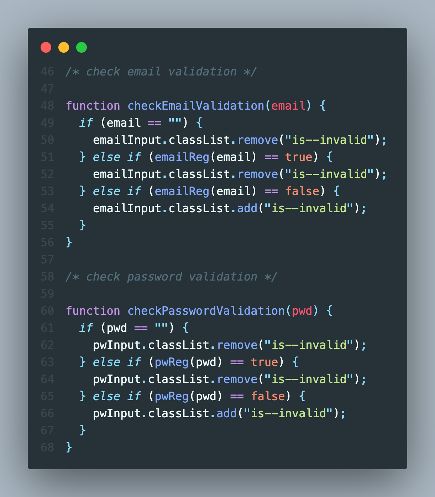
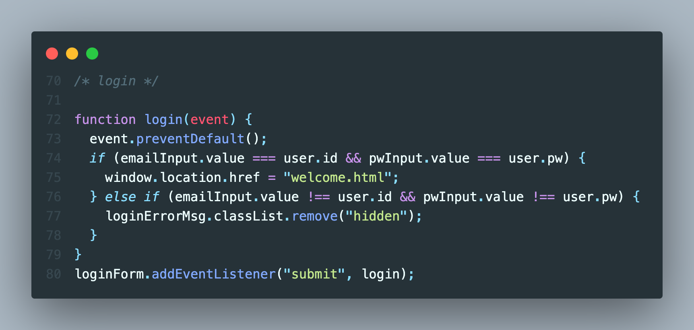
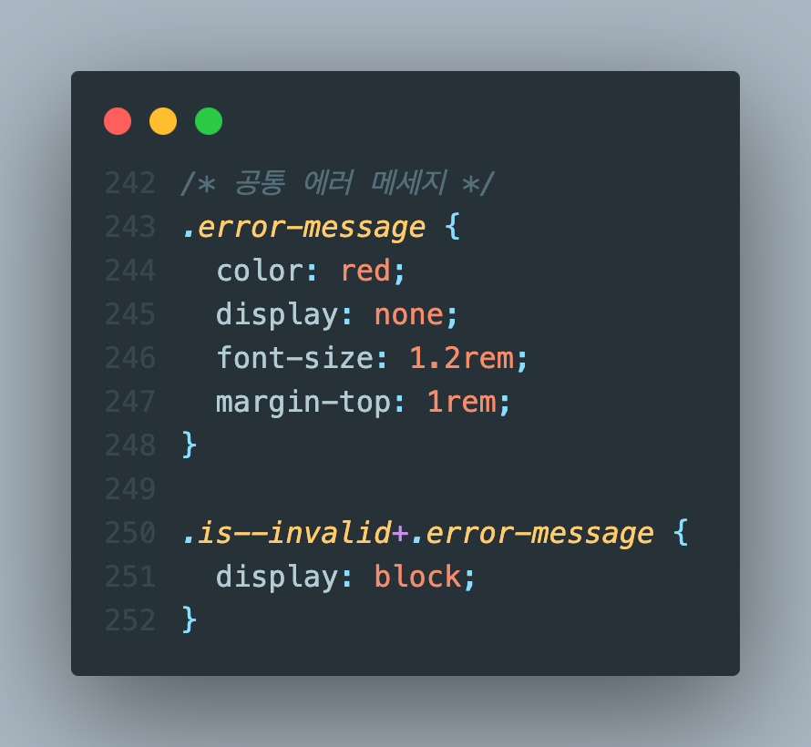
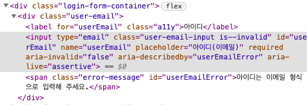
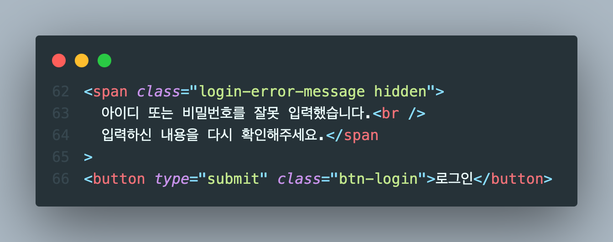
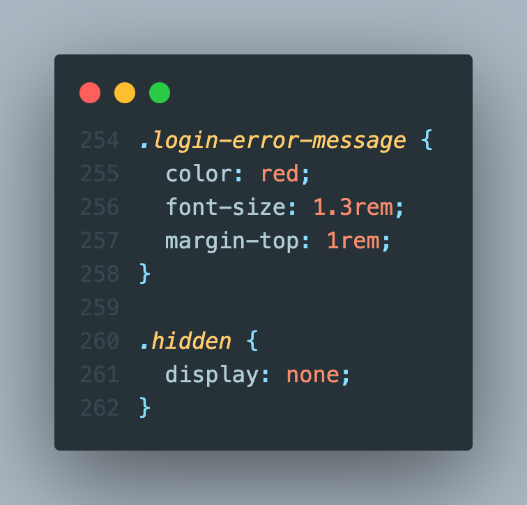

# 2023.12.8 / 과제 1

 

- [x] 로그인 성공

 

- [x] 로그인 실패

 

## STEP 1 - Element, Input event

 

- [x] email/password 유효성 검증을 위해 input 클래스를 불러옴
- [x] 각 input에 addEventListener 메소드를 사용하여 내용이 입력될 때마다 handle 함수가 실행되게 함
- [x] handle 함수가 실행되면 다음 STEP의 checkValidation 함수에 입력받은 input value를 보내줌

 

## STEP 2 - Input Validation

 

- [x] STEP 1의 handle 함수로부터 보내진 input value에 매개변수 이름을 지정하여 비교
- [x] input value가 공란이거나 유효성 검증을 통과하여 true를 반환하면 HTML의 input 태그에서 is--invalid 클래스 삭제
- [x] 유효성 검증을 통과하지 못하면 에러 메세지 출력을 위해 is--invalid 클래스 추가

- [ ] 비교연산자로 == 를 써야하는지 === 를 써야 하는지 확실하게 모르겠음

 

## STEP 3 - Login Validation

 

- [x] preventDefault 메서드를 추가하여 로그인 버튼을 눌러 submit 동작 시 새로고침이 되지 않게 함
- [x] 입력받은 값이 user 변수의 value와 일치하면 welcome.html 페이지로 이동
- [x] 일치하지 않는다면 에러 메세지 출력을 위해 숨겨놓은 HTML의 span 태그에서 hidden 클래스 삭제

- [ ] 창이 새로고침되면 아무것도 입력되지 않은 로그인창이 나와야 하는게 아닌가 싶은데 왜 웹페이지를 찾을 수 없어요 가 나오는지 모르겠음 (405 에러)

 

## STEP 4 - Login Error Message

 

- [ ] CSS의 .is--invalid+.error-message 의미를 잘 모르겠음. 각각 다른태그에 들어있는 클래스인데 어떻게 적용이 되는건지 궁금함
- [x] 위의 CSS 코드들을 새로 추가한 login-error-message 클래스에도 적용시켜보려 했으나 is--invalid 클래스가 추가되어도 메세지 출력이 되지 않아 아래의 다른방식으로 출력함

 

 

- [x] 메시지 출력시 span 태그에서 hidden 클래스 삭제
