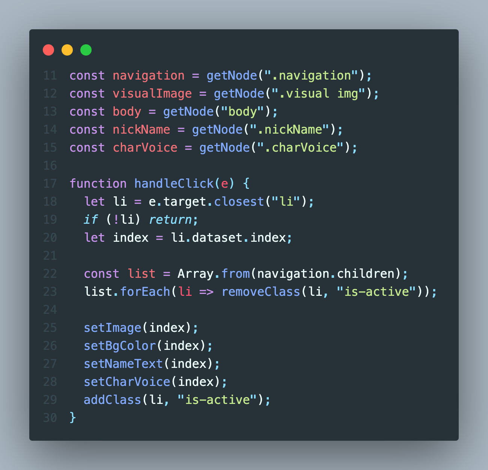

# 2023.12.14 / 과제 2

 

https://github.com/Lulurem/js-homework/assets/126847944/819a5c30-4945-4629-b419-7d4a9fefbf97

- [x] 작동 화면 / 업로드된 플레이어에서 오디오 싱크밀림 현상이 있음 😑

 

## STEP 1 - Element, Click Event

 

- [x] 이벤트가 필요한 요소들 불러오기
- [x] navigation 노드의 작은 포스터들이 클릭 될 때마다 일어나야 하는 이벤트들을 handleClick 함수에 담아 addEventListener를 통해 실행
- [ ] 범쌤이 이벤트 핸들러들은 하단에 따로 묶어서 관리해 주는게 가독성 측면에서 좋을 것 같다고 하셨는데 그 위치가 핸들러 함수들의 바로 아래인지 아니면 모든 코드들의 아래인지 모르겠음

- [x] handleClick 함수 작동원리

  1. 클릭한 타겟에서 가장 가까운 li 요소를 변수 li에 담음
  2. 만약 li 요소가 존재하지 않을 경우 return 하고 함수 종료
  3. li 요소가 존재한다면 변수 li의 data-index 값을 변수 index에 담음

  4. navigation 노드의 자식인 li 요소들을 Array.from 메서드를 사용해 배열로 만들고 변수 list에 담음
  5. 배열 list에 forEach 메서드를 돌려 배열의 모든 값에서 "is-active" 클래스 제거

  6. 클릭한 li 요소에 후술할 함수들을 차례대로 실행 후 "is-active" 클래스를 추가하여 테두리선을 출력해 선택된 이미지를 식별할 수 있게 함

 

## STEP 2 - Set Functions

공통적으로 handleClick 함수에 선언된 변수 index의 값을 매개변수로 받아 사용

 

- [x] data 배열의 name 값이 대문자여서 소문자로 만들기 위해 toLowerCase 메서드가 필요하므로 변환된 값을 변수 dataName에 담음
- [x] 클릭된 작은 포스터의 index에 따라 visualImage 노드의 값이 변경되어 이미지와 대체 텍스트가 변경됨
- [x] [index -1]인 이유는 자바 스크립트의 배열은 0부터 시작하지만 index.html의 data-index 값이 1부터 시작하고 있기 때문

 

 

- [x] body 요소에 inline style로 값을 덮어씌워 배경색이 변경되게 함

 

 

- [x] nickName 노드의 텍스트와 폰트변경

 

 

- [x] setImage와 마찬가지로 소문자로 변환하여 재생될 오디오 소스값 변경
- [x] 음량이 균일하지 않아 노멀라이즈 하였음

- [ ] 노드와 요소라는 단어를 섞어쓰고 있는데 제대로 쓰고있는 건지 모르겠음 🤔
- [ ] 변수 이름을 지칭할 때는 노드, html 태그를 지칭할 때는 요소를 사용하였음
